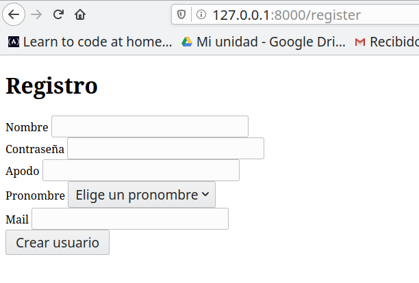
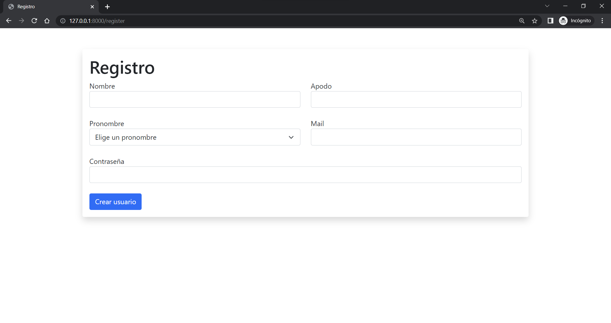

# Auxiliar 3: Django Users y HTML + CSS

Hoy implementaremos un sistema de usuarios en nuestra aplicación de tareas y le agregaremos un estilo a la página de register. Empieza clonando este repositorio en tu computador para empezar la actividad.

> Deben correr el proyecto en un nuevo ambiente virtual utilizando el `requirements.txt` que tiene este proyecto.

1. `python3 -m venv env` en Linux o `python -m venv env` en Windows para crear el nuevo ambiente virtual. Creenlo dentro de la carpeta del proyecto.
2. `source env/bin/activate` en Linux o `env\Scripts\activate` en Windows para iniciar el ambiente virtual.
3. `python -m pip install --upgrade pip` o solo `pip install --upgrade pip`
4. `pip install -r requirements.txt`

Ahora  vamos a agregarle usuarios a nuestra aplicación.

## Actividad
### [Parte 0: Borrar la Base de Datos]
Como hoy cambiaremos el modelo de usuarios predeterminado de Django, habrá que comenzar la base de datos desde 0. 
Esto significa eliminar todas las migraciones y la base de datos de sqlite. 

Para esto tendrás que borrar la carpeta `todoapp/migrations`, `categorias/migrations` y el archivo `db.sqlite3`. 
> Esto solo se hará hoy y al inicio de todo, nunca debería haber necesidad de borrar todo y empezar denuevo. 

### [Parte 1: Crear Usuarios]

1. __Crear modelo `User`__

    * En `todoapp/models.py` agregaremos el modelo `User` que heredará de `AbstractUser` y le pondremos los atributos apodo y pronombre para tener más información sobre le usuarie. Al hacer esto vamos a tener acceso a los atributos base de un User de Django y a toda la funcionalidad de autenticación. 

        > Importante! La clase User tiene que ser la primera clase que aparezca en el modelo. 
    
        ```python
        
      from django.contrib.auth.models import AbstractUser
        
      class User(AbstractUser):
          pronombres = [('La','La'),('El','El'), ('Le','Le'),('Otro','Otro')]
          pronombre = models.CharField(max_length=5,choices=pronombres)
          apodo = models.CharField(max_length=30)
            
        ```
      > El pronombre será un CharField pero solo podrá ser alguna de las opciones definidas en la variable pronombres. El primer elemento del par será el valor del atributo, y el segundo elemnto del par será el valor en lenguaje natural. En este caso les llamaremos igual. 
      
    * Antes de hacer las migraciones tenemos que hacer un paso más. 
        Vamos a ir a `TODOproject/settings.py` y agregaremos esta línea: 
    
        `AUTH_USER_MODEL = 'todoapp.User'`
    
        Con esta linea le diremos al proyecto que el sistema de usuarios ahora será en base al modelo User que acabamos de crear. 
    
    *  Luego de agregar este modelo hay que hacer: 
        ```python
       $ python manage.py makemigrations todoapp categorias
       $ python manage.py migrate
        ```
       Con esto los cambios al modelo se reflejan en la base de datos. 
    *  Ahora puedes hacer `python manage.py runserver` para correr la app y al entrar a `127.0.0.1:8000/tareas` deberías ver el form de tareas. 
        > Como en el primer paso borramos todos los datos de la base de datos, ahora no tendrás categorías para agregar tus tareas. 
        > Para arreglar esto, en la carpeta categorías de este repositorio hay un archivo `.json` con catogrías listas para agregar. Guarda este archivo en la carpeta `categorias`. Para usar este archivo tendrás que correr el siguiente comando: 
        
        >`python manage.py loaddata categorias/categorias.json` 
    
2. __Formulario de registro de usuarios__:
    
    Para crear un nuevo usuario crearemos una nueva URL que será `/register`. 
    Al entrar a esta URL habrá un formulario que, luego de llenarlo correctamente, creará un nuevo `User` y nos llevará a la página de inicio de la app. 
    
    2.1 __URLs__
     
     Primero crearemos la URL en `todoapp/urls.py`, agregando la siguiente línea: 
     
     ```python
   path('register', views.register_user, name='register_user'), 
    ``` 
   
   2.2 __Views__

    Luego tenemos que hacer la view `register_user` para mostrar el formulario. Para eso colocamos el siguiente código en `todoapp/views.py`:
  
    ```python
   def register_user(request):
       return render(request,"todoapp/register_user.html")
    ```
   >Fíjate que en views creamos el método `register_user` porque en `urls.py` dijimos que `/register` estaría asociado a este método. 
   
   2.3 __Templates__
   
   Finalmente tenemos que crear el formulario para registrar al usuario. 
   Este lo guardaremos en `/todoapp/templates/register_user.html` y llevará lo siguiente: 
   ```html
        <!DOCTYPE html>
        <html lang="en">
        <head>
           <meta charset="UTF-8">
           <title>Registro</title>
        </head>
        <body>
           <h1> Registro </h1>
           <form method="post">
               
               <div class="form-group">
                   <label for="nombre_usuario">Nombre</label>
                   <input type="text" class="form-control" id=nombre_usuario name="nombre" required>
               </div>

               <div class="form-group">
                   <label for="contraseña">Contraseña</label>
                   <input type="password" class="form-control" id="contraseña" name="contraseña" required>
               </div>

                <div class="form-group">
                   <label for="apodo">Apodo</label>
                   <input type="text" class="form-control" id="apodo" name="apodo" required>
                </div>

               <div>
                   <label for="pronombre">Pronombre</label>
                   <select id="pronombre" class="form-control" name="pronombre" required>
                       <option class="disabled" value="">Elige un pronombre</option>
                       <option value="El">El</option>
                       <option value="La">La</option>
                       <option value="Le">Le</option>
                       <option value="Otro">Otro</option>
                   </select>
               </div>

                <div class="form-group">
                    <label for="mail">Mail</label>
                    <input type="email" class="form-control" id="mail" name="mail" required>
                </div>
                <button type="submit">Crear usuario</button>
           </form>
        </body>
        </html>
    ```

    __¿Qué hay en este código HTML?__ 
    
    Lo mas importante por ahora es el formulario que se crea con la etiqueta ```<form>```. 
    Todo lo que está dentro de form serán los campos que tendremos que llenar para crear un usuario. 
    Cada "campo" está formado por un ```<label>``` y un ```<input>``` (este último es donde ingresamos los datos). 
    Es importante que para la contraseña el input tenga type `password` y que para el correo tenga type `email`. 
    
    * Ahora si hacemos ```python manage.py runserver``` e ingresamos a `127.0.0.1:8000/register` deberíamos ver el formulario de registro. 
   
   
   
   > ¿Qué pasa si intentamos crear un usuario? Nada, porque no le hemos dado instrucciones a la app para registrar el usuario. 
   
3. __Guardar datos del formulario__:
   
   Cuando creamos el método `register_user` solo le indicamos que hiciera render del formulario. 
   Ahora queremos diferenciar entre una llamada GET (cuando cargamos la página) y una llamada POST (cuando enviamos un formulario).
   
   Para esto vamos a editar `todoapp/views.py` y diferenciar estos dos casos: 
   ```python
   def register_user(request):
       if request.method == 'GET': #Si estamos cargando la página
        return render(request, "todoapp/register_user.html") #Mostrar el template

       elif request.method == 'POST': #Si estamos recibiendo el form de registro
        #Tomar los elementos del formulario que vienen en request.POST
        nombre = request.POST['nombre']
        contraseña = request.POST['contraseña']
        apodo = request.POST['apodo']
        pronombre = request.POST['pronombre']
        mail = request.POST['mail']

        #Crear el nuevo usuario
        user = User.objects.create_user(username=nombre, password=contraseña, email=mail, apodo=apodo, pronombre=pronombre)

        #Redireccionar la página /tareas
        return HttpResponseRedirect('/tareas')
   ```
    
   ```python
   #Estos son los imports que van al inicio de views.py
   from todoapp.models import User
   from django.http import HttpResponseRedirect
    ```
   
   En el código anterior, cuando el método es POST estamos haciendo lo siguiente: 
   * recuperamos los datos que vienen del formulario.
   * creamos un User con estos datos.
   * redirigimos a la página de inicio. 
   
   
   > Atención: En el formulario de registro le pusimos un _name_ a cada ```<input>``` y con ese name podemos acceder a los datos en ```request.POST```.
   
   
 4. __Prueba que el formulario esté funcionando__ y agrega cuentas. 
       
       Para comprobar que se crearon puedes hacer lo siguiente: 
       * Editar `todoapp/admin.py` y agregar 
       ```
        from todoapp.models import User, Tarea
        from categorias.models import Categoria
        
        admin.site.register(Categoria)
        admin.site.register(User)
        admin.site.register(Tarea)
    ```
       
       * Crea un superusuario haciendo ```python manage.py createsuperuser```. Les va a pedir datos como nombre de usuario, email, contraseña. Llenen con datos cualquiera, pero memoricen el usuario y la contraseña.
       
       * Luego ingresa a 127.0.0.1:8000/admin y deberías poder ver todos los Users que has creado! 
       


----------------------------------------------------

### [Parte 2: Embellecer el register]

Ahora deben usar las propiedades CSS y Bootstrap para obtener un resultado similar a este:



Solo deben trabajar con el archivo `register_user.html` que está en `todoapp/templates/todoapp/`, y `style.css` que deben crear en `todoapp/static/todoapp/` (directorio static/todoapp también lo deben crear).

### Enlazar hoja de estilos y Bootstrap:

```html
<!-- Estilos locales: -->
<link rel="stylesheet" type="text/css" href="static/todoapp/style.css">
<!-- Estilos de Bootstrap -->
<link href="https://cdn.jsdelivr.net/npm/bootstrap@5.2.0/dist/css/bootstrap.min.css" rel="stylesheet" integrity="sha384-gH2yIJqKdNHPEq0n4Mqa/HGKIhSkIHeL5AyhkYV8i59U5AR6csBvApHHNl/vI1Bx" crossorigin="anonymous">
```
Estas líneas deben ir dentro del `<head>...</head>` de su archivo .html. Luego podrán usar los estilos que definan en el archivo style.css, o los estilos de Bootstrap guiándose por la documentación (por ejemplo, [los botones](https://getbootstrap.com/docs/5.1/components/buttons/)). Con solo linkear los estilos de Bootstrap, ya se notará un cambio en la interfaz.

> Quizá no se vea reflejados los cambios. Tendrán que probar cortando la página y volviendola a correr con `python manage.py runserver`.

Como HINT, para el diseño de esta página se utilizaron los siguientes elementos:
1. [Buttons](https://getbootstrap.com/docs/5.2/components/buttons/#examples)
2. [Containers](https://getbootstrap.com/docs/5.2/layout/containers/#default-container)
3. [Form Grid](https://getbootstrap.com/docs/5.2/layout/containers/#default-container)
4. [Shadows](https://getbootstrap.com/docs/5.2/utilities/shadows/#examples)

### Enlaces
- [Selectores de CSS](https://www.w3schools.com/cssref/css_selectors.asp)
- [CSS Diner](https://flukeout.github.io/): Para practicar el uso de selectores.
- [Flexbox Froggy](https://flexboxfroggy.com/): Para practicar el uso de `display: flex;`.
- [Bootstrap](https://getbootstrap.com/)
